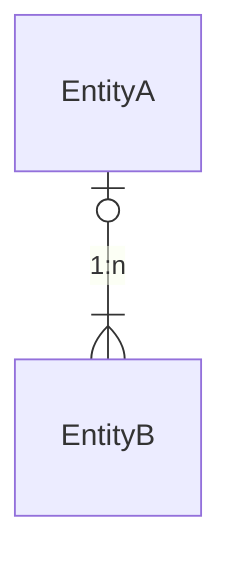
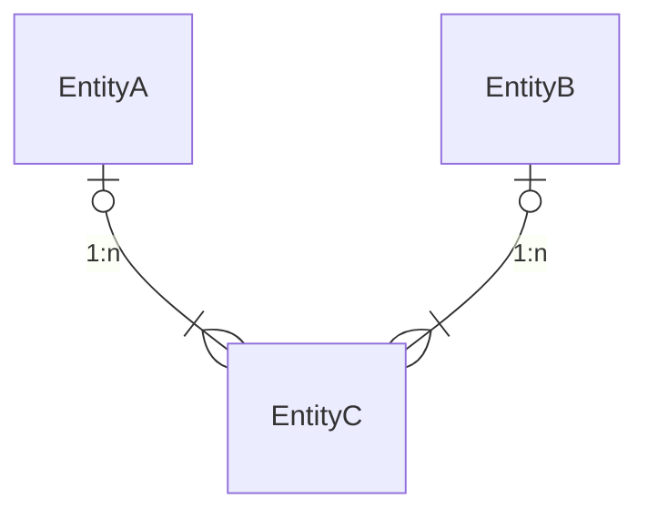

本文继续介绍如何在typora中使用基于Mermaid的语法进行画图，本次介绍的画图类型为甘特图和实体关系图。


# 1. 使用typora绘制甘特图

> 甘特图（Gantt chart）又称为横道图、条状图(Bar chart)。 其通过条状图来显示项目、进度和其他时间相关的系统进展的内在关系随着时间进展的情况。 以提出者亨利·劳伦斯·甘特（Henry Laurence Gantt）先生的名字命名。

​		一般在项目管理中经常会用到甘特图，用于管理项目进度，以及对子任务之间的依赖关系的管理。甘特图会将每个计划的任务记录为从左到右延伸的连续条形图。 x轴代表时间，y轴记录不同的任务以及完成任务的顺序。


## 1.1 甘特图语法

```yacas
gantt

title 软件开发迭代周期示意图 
%% dateFormat 用于定义输入代码中的日期格式，注意这里并不是定义所显示图中的格式
dateFormat YYYY-MM-DD  
%% axisFormat这个参数是用于定义在x轴上显示的日期格式
axisFormat  %Y/%m/%d   

%% section 可以将一个任务划分为多个区间，可以定义为一个项目中的多个角色等。
section 产品经理      

%% 定义子任务的格式： [任务状态(active,done)],[重要任务(crit)],[任务id],[after 前置任务id], [持续时间]
  需求分析                      :done, po-task1, 2020-01-06,1d
  绘制原型                      :done,po-task2, after po-task1, 1d
  沟通需求                      :active,po-task3, after po-task2,1d
section 开发
  理解需求                      :active,dev-task1, after po-task2, 1d
  架构设计                      :dev-task2, after dev-task1, 2d
  编码开发                      :crit, dev-task3, after dev-task2, 3d
  修复bug                      :dev-task4, after dev-task3, 3d
section 测试
  理解需求                      :active, qa-task1, after po-task2, 1d
  编写测试用例                   :qa-task2, after qa-task1 , 2d
  测试                         :crit,qa-task3, after dev-task2 , 4d
section 运维
%% 如果一个子任务依赖多个前置任务的话，可以在after后使用空格分隔标识。
  部署上线                      :crit,ops-task1, after dev-task4 qa-task3, 1d
  

```


## 1.2 甘特图输入日期支持的格式

```javascript
Input       Example             Description:
YYYY        2014                4 digit year
YY          14                  2 digit year
Q           1..4                Quarter of year. Sets month to first month in quarter.
M MM        1..12               Month number
MMM MMMM    January..Dec        Month name in locale set by moment.locale()
D DD        1..31               Day of month
Do          1st..31st           Day of month with ordinal
DDD DDDD    1..365              Day of year
X           1410715640.579      Unix timestamp
x           1410715640579       Unix ms timestamp
H HH        0..23               24 hour time
h hh        1..12               12 hour time used with a A.
a A         am pm               Post or ante meridiem
m mm        0..59               Minutes
s ss        0..59               Seconds
S           0..9                Tenths of a second
SS          0..99               Hundreds of a second
SSS         0..999              Thousandths of a second
Z ZZ        +12:00              Offset from UTC as +-HH:mm, +-HHmm, or Z
```


## 1.3 甘特图坐标轴显示日期格式

```javascript
%a - abbreviated weekday name.
%A - full weekday name.
%b - abbreviated month name.
%B - full month name.
%c - date and time, as "%a %b %e %H:%M:%S %Y".
%d - zero-padded day of the month as a decimal number [01,31].
%e - space-padded day of the month as a decimal number [ 1,31]; equivalent to %_d.
%H - hour (24-hour clock) as a decimal number [00,23].
%I - hour (12-hour clock) as a decimal number [01,12].
%j - day of the year as a decimal number [001,366].
%m - month as a decimal number [01,12].
%M - minute as a decimal number [00,59].
%L - milliseconds as a decimal number [000, 999].
%p - either AM or PM.
%S - second as a decimal number [00,61].
%U - week number of the year (Sunday as the first day of the week) as a decimal number [00,53].
%w - weekday as a decimal number [0(Sunday),6].
%W - week number of the year (Monday as the first day of the week) as a decimal number [00,53].
%x - date, as "%m/%d/%Y".
%X - time, as "%H:%M:%S".
%y - year without century as a decimal number [00,99].
%Y - year with century as a decimal number.
%Z - time zone offset, such as "-0700".
%% - a literal "%" character.
```


# 2.使用typora绘制实体关系图

>E-R图也称实体-联系图(Entity Relationship Diagram)，提供了表示实体类型、属性和联系的方法，用来描述[现实世界](https://baike.baidu.com/item/现实世界/688877)的[概念模型](https://baike.baidu.com/item/概念模型/3187025)。


​		实体图在日常的数据库建模设计中经常用到的一种图形，我们也可以借助typora基于Mermaid语法来轻松画出实体关系图。Mermaid所使用ER图的语法是与plantUML兼容的语法，并且可以通过标记实体之间的关系，语法可以抽象为如下结构：

```markdown
 <first-entity> [<relationship> <second-entity> : <relationship-label>]
```

其中：

- First-entity:  实体的名称，名称必须以字母字符开头，并且还可以包含数字，连字符和下划线。

- relationship：实体间的关系，例如：

  | 左边 | 右边 |          含义          |
  | :--: | :--: | :--------------------: |
  | \|o  | o\|  | 零个或一个，即至多一个 |
  | \|\| | \|\| |      有且只有一个      |
  |  }o  |  o{  |       零个或多个       |
  | }\|  | \|{  | 一个或多个，即至少1个  |

- second-entity：所关联实体的名称

- relationship-label：从第一个实体的角度描述了这种关系。

  


## 2.1 一对一关系


## 2.2 一对多关系




## 2.3 多对多关系

A、B两个实体通过一对多的关联表C实现多对多的关系




# 3. 结语

​		使用typora这款写作软件已经有段时间了，已经逐渐习惯了使用这种简洁所见即所得的工具来记录平时工作生活中的点滴思维，已经成为写blog、记录读书笔记的主力工具，结合网盘一起实用，基本上可以成为印象笔记的替代品。其实typora还有很多更实用的高阶功能，后面看看有时间再深入总结一下。